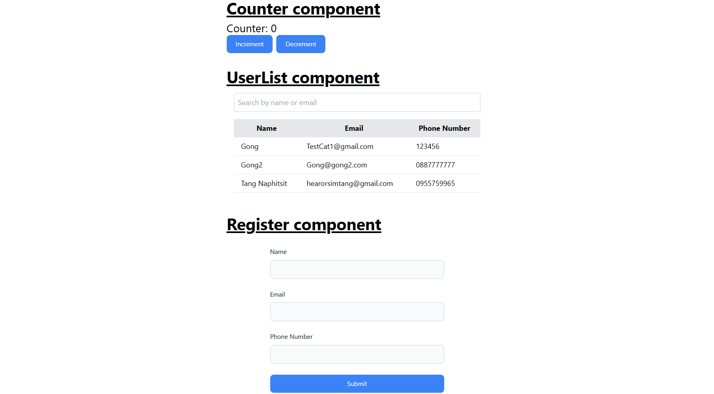

# React + Vite + Vitest

This template provides a minimal setup to get React working in Vite with HMR and some ESLint rules.




## Test commands
* ```npx vitest```
* ```npx vitest --coverage```
* ```npx vitest --ui```

